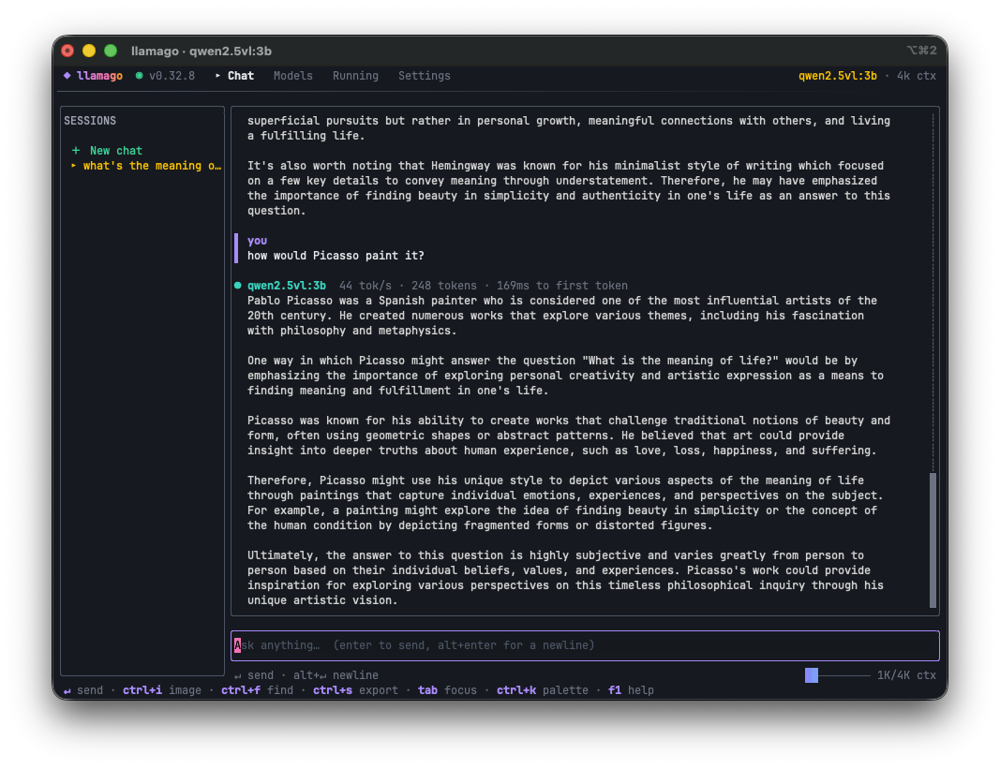
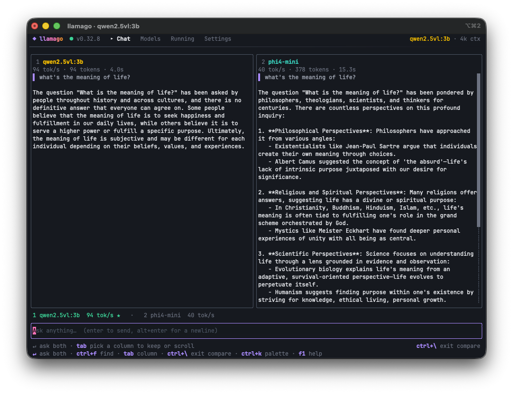
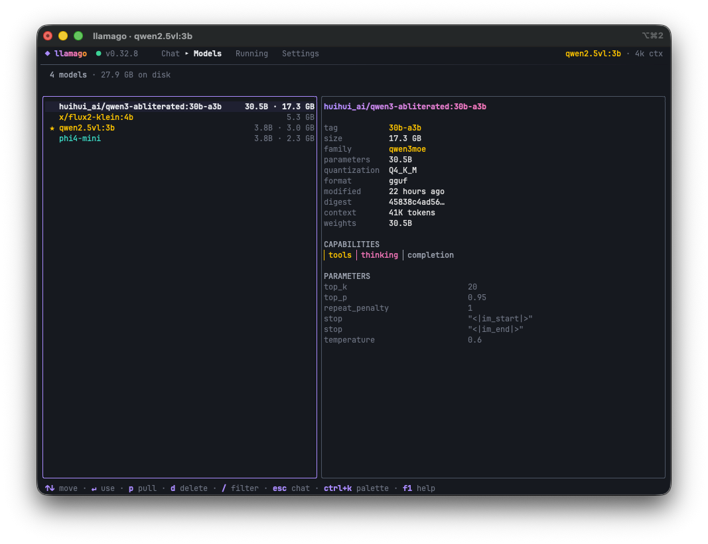

# llamago

TUI for [Ollama](https://ollama.com): chat with local models, manage what's installed, run same prompt with different models side-by-side.



## Features

**Chat**
- Streaming responses with live markdown rendering and syntax-highlighted code
- Reasoning models supported with `thinking` channel streamed
- Live throughput readout, tokens/sec, token counts and time-to-first-token per response
- Sessions persist automatically
- Regenerate, stop mid-generation, copy responses
- Context meter warns before Ollama silently trims old turns
- Export the conversation with `ctrl+s`, or `/export html` for a self-contained page and `/export json` for the raw session
- Rewind, fork or delete an exchange from any point in the history
- [Tools](docs/tools.md): models that support them can do basic operations, or add your own via config
- [Slash commands](docs/slash-commands.md) in the composer
- Multiple Ollama servers: `/host add <name> <url>`, then `/host <name>` to switch
- Inline text file into the composer as a fenced, named block, with a token estimate
- Themes - `midnight`, `daylight`, `ember`
- Sampling presets - `precise`, `balanced`, `creative`, plus your own via `/preset save <name>`
- Prompt library: `/save <name>` keeps the prompt you just sent, `/prompt <name>` brings it back, and `{{blanks}}` are named under the composer until they are filled
- Attach images with `ctrl+i` or from the command palette

**Race models side by side**

- Type a prompt, press `ctrl+\`, pick a second model, they'll both stream at once in split columns with live tok/s sparklines racing each other
- `alt+a` adds another model mid-race, up to what the UI is wide enough to show
- Verdict names fastest model

**Models**

- Browse everything installed with size, parameter count, quantization and family
- Inspect capabilities, context length, system prompt and default parameters
- Pull new models from a toplist, or enter its name
- Delete models, unload from memory

**Running**

- Live view of what Ollama is holding in memory
- GPU/CPU split meter per model and a countdown to eviction

## Install

Requires Go 1.26 or newer.

```sh
go install github.com/balintb/llamago@latest
```

Or from a checkout:

```sh
go build -o llamago .
./llamago
```

## Usage

`llamago` talks to a running Ollama server and does not start one for you. With no server reachable it exits straight away, naming the host it tried, so start `ollama` first:

```sh
ollama serve      # if not running
llamago
```

Flags:

```
-host string     Ollama host (default $OLLAMA_HOST or http://127.0.0.1:11434)
-model string    model to start with
-system string   system prompt for this run
-version         print version and exit
```

Image support is detected from the terminal. Override it with the `graphics` setting in `config.json`: `auto`, `kitty`, `iterm2`, `sixel` or `none`.

## Keys

Press `f1` for full keymap, or `ctrl+k` to search every command by name. Whole list is in [docs/keys.md](docs/keys.md); ones worth knowing before you start:

| Key | Action |
| --- | --- |
| `ctrl+k` | Command palette |
| `f1` | Keymap |
| `enter` / `alt+enter` | Send / newline |
| `↑` | Previous prompt |
| `shift+↑` | Select a message in the history |
| `tab` | Move between the composer, transcript and sessions |
| `esc` | Step outward, ending at the tab strip |
| `ctrl+\` | Race two models on this prompt |

Typing `/` in the composer runs a [command](docs/slash-commands.md) instead of sending a prompt.

## Storage

Config and sessions live in `$XDG_CONFIG_HOME/llamago`, defaulting to `~/.config/llamago`:

```
~/.config/llamago/
  config.json          settings
  prompts.json         saved prompts
  sessions/*.json      one file per conversation
  exports/*            markdown, HTML and JSON exports
  attachments/*        images, named by content digest
```

See config [docs/configuration.md](docs/configuration.md).

## Documentation

- [Keys](docs/keys.md) - full keymap
- [Configuration](docs/configuration.md)
- [Slash commands](docs/slash-commands.md) - what `/` does in the composer
- [Tools](docs/tools.md) - what a model can run, and adding your own

## Contributing

`llamago` welcomes all and any contributions! Let's make this awesome. Open an issue, and go straight to a pull request. Commit subjects are conventional commits - `feat:`, `fix:`, `docs:` and the rest. Use conventional commits. Keep the diff to the change itself, run `go test -short ./...` and `go vet ./...` before opening, PR template asks for the rest.

`llamago` is built in Go with Bubble Tea, Lip Gloss, Bubbles and Glamour. We're fabulous, what's there else to say?

```sh
git config core.hooksPath .githooks   # once per clone: enables the commit-msg check
go test ./...              # unit and layout tests, plus live tests if Ollama is up
go test -short ./...       # skip anything that loads a model
go vet ./...
```

Layout tests render every screen at a range of terminal sizes and assert that each frame is exactly as tall as the terminal and that no line exceeds its width. Live tests exercise real Ollama wire format - skip cleanly when no server is reachable.

To check screens as plain text:

```sh
LLAMAGO_SNAPSHOT=1 go test -run TestSnapshot ./internal/ui/
```
